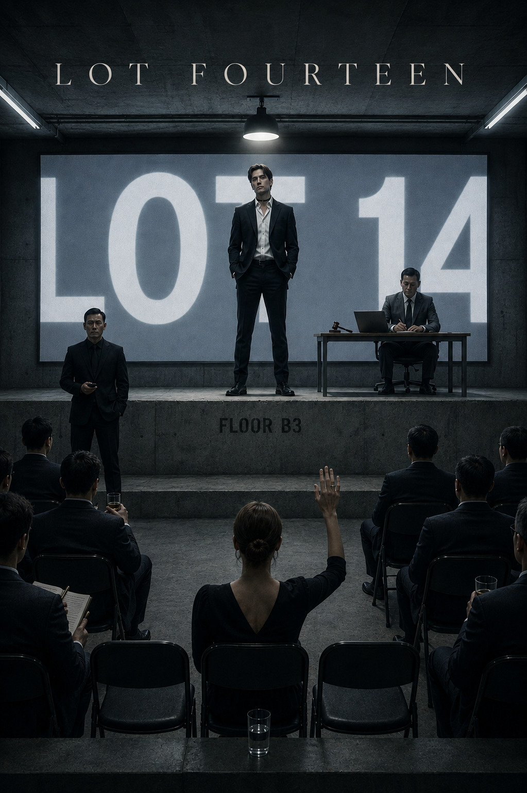

Lot Fourteen. Literarischer Roman, laufende Arbeit. Suedkorea, Gegenwart,
Chaebol-Milieu. Manuskript auf Englisch, Absprachen auf Deutsch.

chapters/   die Kapitel, chNN_vX_Y_en.md; der Build nimmt immer die hoechste Version
doc/        die acht Quelldokumente (craft, leads, cast, world, continuity, plot, next, decisions)
cover/      Coverbild

Start mit CLAUDE.md. Dort stehen die Formatregeln, die Stimme und die
Kontinuitaets-Fallen.

Lesefassung der Geschichte: book.md. Alle Regeln und der Kanon am Stueck:
HANDBUCH.md. Wie viele Kapitel es gibt und wie lang sie sind: MANIFEST.txt, vom
Build geschrieben. Was als Naechstes kommt: doc/07-next.md.
